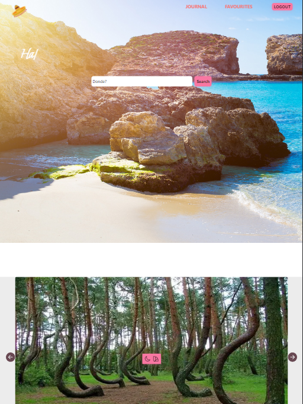
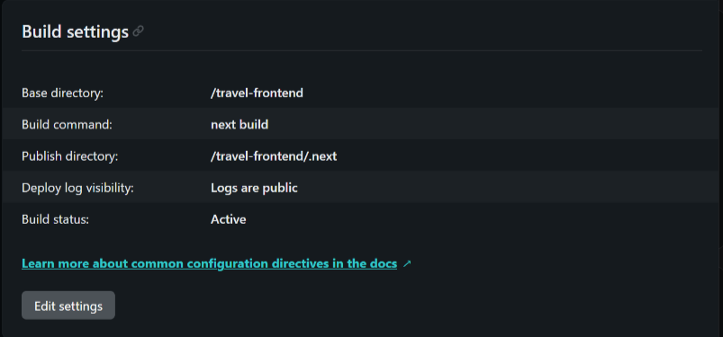

# Amigo

Amigo is a travel companion app that helps users to connect to the local culture of a city by suggesting non-touristic places that are usually not found in a typical travel app.

Have a look<a href="https://amigostravel.netlify.app/"> here</a>!

---

[**Technology**](#technology)

[**Libraries Used**](#libraries-used)

[**Features**](#features)

[**Deployment**](#deployment)

---

## Technology

The frontend for Amigo is built using Next.js and JavaScript. For styling we have used TailwindCSS, for registration and log in we used Firebase Authentication, and testing was done with Jest and React-Testing-Libraries. All points of interest comes from the <a href="https://opentripmap.io/product">OpenTripMap API</a>. The data is stored in our backend database (<a href="https://github.com/SchoolOfCode/bc13_final-project_back-end-3-amigos">Backend Repo</a>).

## Libraries Used

- **[Axios](https://www.npmjs.com/package/axios):** Promise based HTTP client for the browser and node.js. It was used for CRUD operations in the frontend.
- **[Typewriter](https://www.npmjs.com/package/typewriter):** We used typewriter to give the illusion of the text being typed on our landing page.
- **[React-Icons](https://www.npmjs.com/package/moment):** We used react-icons for creating the hamburger menu in the mobile version of the app.
- **[React-Firebase-Hooks](https://www.npmjs.com/package/react-firebase-hooks):** It used for authorization
- **[qs](https://www.npmjs.com/package/qs):** qs allowed for parsing of query strings throughout the application
- **[TailwindCSS-Themer](https://www.npmjs.com/package/tailwindcss-themer):**
  Automatically generate variants for various themes

## Features

- Search for sites of interest through the OpenTripMap API
- When data is being fetched from the API there is a loader that comes up to inform user that is loading
- If no results found it will inform the user
- If user is not logged in a message will popup to log in
- Add recommended sites to your personal favourite dashboard after log in
- User has the option to delete a favourite sites from favourite dashboard
- On the favourite dashboard user can search for their saved sites by city

## Deployment

Frontend was deployed using Netlify. The reason for choosing Netlify was because we are using Next.js and they have good support for it.

